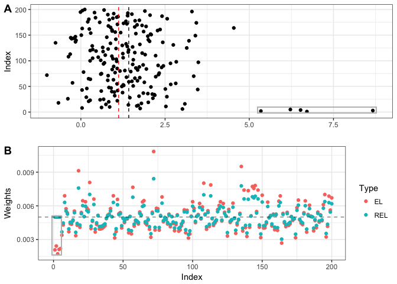

Scalable and robust computation for the composite empirical likelihood test
================
Hoang Tran
3/19/2018

Installation
------------

``` r
devtools::install_github("hoangtt1989/BICEP")
```

Simulated linear regression example
-----------------------------------

``` r
library(BICEP)
set.seed(123)

n <- 100
p <- 5

beta_true <- c(5, 5, 3, 2, 2)
X <- matrix(rnorm(n * p), nrow = n, ncol = p)
noise <- rnorm(n)
y <- X %*% beta_true + noise
```

What is the log empirical likelihood ratio for testing that the first two coefficients equal their true value?

``` r
test1 <- TRICEP_glm_beta_fixed(beta_true[c(1, 2)], c(1, 2), X, y)
test1$logelr
```

    ## [1] -0.7683117

Compute a confidence interval for the first coefficient

``` r
confint1 <- TRICEP_glm_beta_profiler(1, X, y, conf_level = .05)
confint1
```

    ## $upper_int
    ## [1] 5.194881
    ## 
    ## $lower_int
    ## [1] 4.772233
    ## 
    ## $mean_val
    ## [1] 4.983587
    ## 
    ## $time
    ## [1] 0.6053441

One-dimensional mean with outliers example
------------------------------------------

``` r
library(tidyverse)
```

    ## Loading tidyverse: ggplot2
    ## Loading tidyverse: tibble
    ## Loading tidyverse: tidyr
    ## Loading tidyverse: readr
    ## Loading tidyverse: purrr
    ## Loading tidyverse: dplyr

    ## Conflicts with tidy packages ----------------------------------------------

    ## filter(): dplyr, stats
    ## lag():    dplyr, stats

``` r
library(ggpubr)
```

    ## Loading required package: magrittr

    ## 
    ## Attaching package: 'magrittr'

    ## The following object is masked from 'package:purrr':
    ## 
    ##     set_names

    ## The following object is masked from 'package:tidyr':
    ## 
    ##     extract

``` r
library(janitor)

n <- 200
p <- 1

alpha_add <- -.3
test_idx <- 1

nout <- 5
dirty_idx <- 1:nout
clean_idx <- setdiff(1:n, dirty_idx)
dirty_min <- 4
dirty_max <- 6

set.seed(123)
true_means <- 1.3
```

Generate univrate data with mean equal to 1.3.

``` r
#####generate data with a certain mean
data_mat <- do.call(cbind, lapply(true_means, function(x) {rnorm(n, mean = x)}))
data_df <- as.data.frame(data_mat) %>% 
  clean_names() %>% 
  mutate(idx = 1:n)
##create the test
mean_mat <- matrix(colMeans(data_mat), nrow = n, ncol = p)
Z_mle <- data_mat - mean_mat
mean_test_mat <- mean_mat
mean_test_mat[, test_idx] <- mean_test_mat[, test_idx] + alpha_add
Z_clean_test <- data_mat - mean_test_mat
##
#####
```

Take the first five observations and make them outliers, then perform empirical likelihood and robust empirical likelihood.

``` r
#####pick points and move them far away from the point cloud
dirty_mat <- data_mat
dirty_idx <- 1:nout
dirty_mat[dirty_idx, ] <- dirty_mat[dirty_idx, ] + matrix(runif(nout * p, min = dirty_min, max = dirty_max), nrow = nout, ncol = p)
mean_dirty_mat <- matrix(colMeans(dirty_mat), nrow = n, ncol = p)
dirty_df <- as.data.frame(dirty_mat) %>% 
  clean_names () %>% 
  mutate(Index = 1:n)
dirty_scatter <- ggplot(dirty_df, aes(x = v1, y = Index)) +
  geom_point() +
  geom_vline(xintercept = mean_dirty_mat[1, 1] + alpha_add, linetype = 2, color = 'red') +
  geom_vline(xintercept = mean_dirty_mat[1, 1], linetype = 2) +
  geom_rect(aes(xmin = min(dirty_mat[dirty_idx, ]) - .1, xmax = max(dirty_mat[dirty_idx, ]) + .1, ymin = -2, ymax = 10), color = 'gray', fill = NA, alpha = .1) +
  labs(x = '') +
  theme_bw()
##create the test
Z_dirty_mle <- dirty_mat - mean_mat
mean_dirty_test_mat <- mean_dirty_mat
mean_dirty_test_mat[, test_idx] <- mean_dirty_test_mat[, test_idx] + alpha_add
Z_dirty_test <- dirty_mat - mean_dirty_test_mat
##
#####


#####dirty test
owen_dirty_test <- emplik_concord(Z_dirty_test)
REL_dirty_test <- REL_fixed(Z_dirty_test, q = nout, wts_beta_rep = 2, RB_tau = 1.5, dual_step = 20)
dirty_test_df <- data_frame(EL = as.vector(owen_dirty_test$wts), REL = REL_dirty_test$wts, Index = 1:n) %>% 
  gather(Type, Weights, -Index)
dirty_wts_plot <- ggplot(dirty_test_df, aes(x = Index, y = Weights, color = Type)) +
  geom_point() +
  geom_rect(aes(xmin = -1, xmax = max(dirty_idx) + .8, ymin = min(owen_dirty_test$wts[REL_dirty_test$outlier_idx]) - 1e-4, 
                ymax = max(REL_dirty_test$wts[REL_dirty_test$outlier_idx]) + 1e-4), color = 'gray', fill = NA, alpha = .1) +
  geom_hline(yintercept = 1/n, linetype = 2, alpha = .5) +
  theme_bw()
#####
```

In the top scatter plot, the MLE is the black dashed line and the red dashed line is the candidate value for the mean. The five artificially induced outliers are enclosed in a rectangle to the right.

``` r
ggarrange(dirty_scatter, dirty_wts_plot, nrow = 2, labels = c('A', 'B'))
```


